

  <a href="https://claudeck.dev">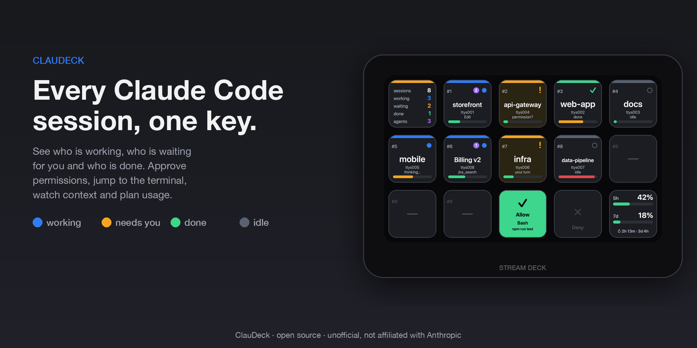</a>

<h1 align="center">ClauDeck</h1>

<strong>Claude Code on your Stream Deck.</strong> Live session keys, approvals and answers from the deck, plan usage, forecasts and alerts.

  <a href="https://claudeck.dev">Website</a> ·
  <a href="https://marketplace.elgato.com/search?q=claudeck">Elgato Marketplace</a> ·
  <a href="https://github.com/onavascuez/ClauDeckWeb/issues">Issues</a> ·
  <a href="https://github.com/onavascuez/ClauDeckWeb/discussions">Discussions</a>

---

This repository is the **public home** of ClauDeck: the website at [claudeck.dev](https://claudeck.dev) is served from it, and **Issues** and **Discussions** for both editions live here. The plugin source is kept in a separate private repository; everything user-facing is in this one.

## Two editions

| | 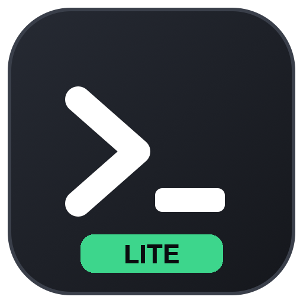 **ClauDeck Lite** | 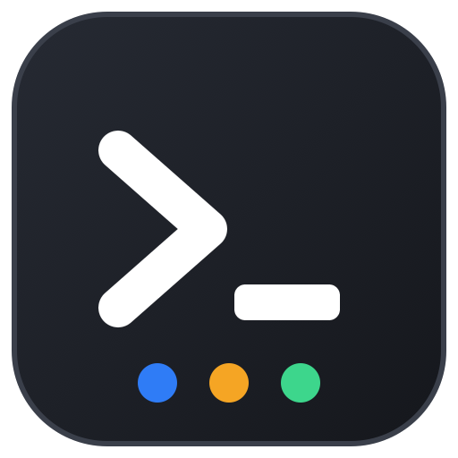 **ClauDeck** |
|---|---|---|
| Price | Free | One-time purchase |
| Plan usage keys (5-hour, 7-day, per model) in six layouts | ✓ | ✓ |
| Extra-usage credits, countdown or clock-time resets | ✓ | ✓ |
| One key per Claude Code session: status, tool, agents, context, name, colour | – | ✓ |
| Approve / always-allow / deny permission prompts from a key | – | ✓ |
| Answer Claude's multiple-choice questions from a key | – | ✓ |
| Session menu, overview key, bundled profiles for every deck | – | ✓ |
| Jump to a session's exact terminal tab (cmux, tmux, iTerm2, Terminal; window-level elsewhere) | – | ✓ |
| Forecast: lockout clock, reset projection, burn rate, budget | – | ✓ |
| History: sparkline and weekly peaks | – | ✓ |
| Native alerts, once per window, with your thresholds | – | ✓ |
| Marketplace | [Get Lite](https://marketplace.elgato.com/product/claudeck-lite-c9984dee-ad07-40c3-a319-0062a4a7d788) | [Get ClauDeck](https://marketplace.elgato.com/product/claudeck-2ed8dd1e-1a28-4442-b5df-7d2e16d4f6d1) |

Both editions share the same renderer and settings. Lite is complete for plan usage and stays free.

## What it looks like

<table>
  <tr>
    <td align="center">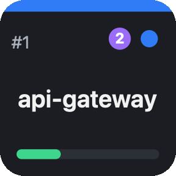 Working · 2 agents</td>
    <td align="center">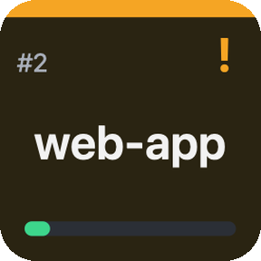 Needs you</td>
    <td align="center">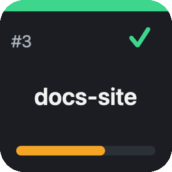 Done</td>
    <td align="center">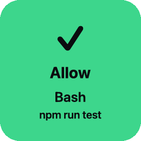 Approve</td>
    <td align="center">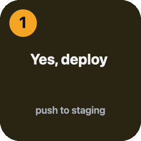 Answer</td>
  </tr>
  <tr>
    <td align="center">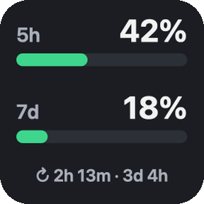 Usage</td>
    <td align="center">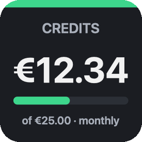 Credits</td>
    <td align="center">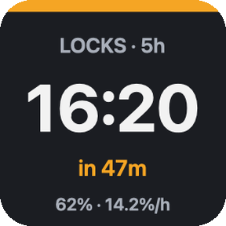 Lockout clock</td>
    <td align="center">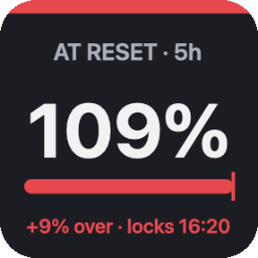 At reset</td>
    <td align="center">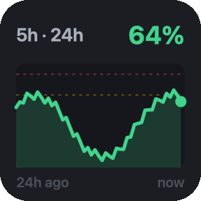 History</td>
  </tr>
</table>

Colours carry the meaning: **blue** working · **amber, blinking** waiting for a decision · **green** finished, not yet looked at · **grey** idle. The thin bar at the bottom of a session key is the context window.

## How it works

Claude Code fires [hooks](https://code.claude.com/docs/en/hooks) on every event (session start, prompt, tool use, permission request, subagent start and stop…). ClauDeck installs an asynchronous hook that forwards those events to the plugin over localhost, so Claude never waits on the deck. The only synchronous hook is the permission prompt, held open until you press a key or, after 90 seconds or when you answer in the terminal, released to the normal prompt.

Plan usage comes from the same endpoint `/usage` uses, read with the login token Claude Code already keeps on your machine. Forecasts and history come from a small local time series (about 31 KB: 24 hours of samples, 14 days of hourly averages, 90 days of daily peaks) that you can switch off, which deletes it.

## Install

1. Get the edition you want from the Elgato Marketplace (links in the table above). The Stream Deck app opens and installs it for you.
2. Drag any ClauDeck key onto your deck.
3. **ClauDeck only:** press **Install hooks** in that key's settings. Sessions you already have open start reporting straight away; there is nothing to restart. Tap **Overview** to open the ready-made profile with a key per session.

Requirements: Stream Deck app 7.1 or newer · Claude Code CLI installed natively (macOS 12+ or Windows 10+; WSL, SSH and containers are not supported because hooks run where Claude runs) · a Claude subscription.

## Support

- **Something broken?** [Open an issue](https://github.com/onavascuez/ClauDeckWeb/issues/new?template=bug_report.md). The template asks for the plugin log; it lives in the plugin folder under `logs/`, and `touch ~/.claude/claude-deck/debug` turns on a trace of every hook call in `~/.claude/claude-deck/hooks.log`.
- **Question or idea?** [Start a discussion](https://github.com/onavascuez/ClauDeckWeb/discussions).
- **FAQ**: terminals, performance, privacy, layouts — on the [website](https://claudeck.dev/#support).

## Privacy

Everything runs on your machine. The plugin reads Claude Code hook events on localhost, Claude Code's own session registry under `~/.claude`, and the Claude Code login token (Keychain on macOS, credentials file on Windows) solely to call Anthropic's usage endpoint. It writes a session snapshot and the usage history to `~/.claude/claude-deck`. No analytics, no third-party servers. **Remove** in the key settings deletes hooks, history and alert memory.

## This repository

`index.html`, `styles.css`, `app.js` and `assets/` are the website, deployed with GitHub Pages to claudeck.dev. Key images are rendered by the plugin's real renderer, so what you see here is what the deck shows.

---

ClauDeck is an independent project. Claude and Claude Code are trademarks of Anthropic; Stream Deck is a trademark of Elgato / Corsair. Not affiliated with either.
